# MINI_ERP

## Indice

- [Stack](#stack)
- [Installazione](#installazione)
- [Avvio](#avvio)
- [Comandi utili](#comandi-utili)
- [Database](#database)
  - [Prisma](#prisma)
  - [Componenti base](#componenti-base)
  - [Visualizzare i dati](#visualizzare-i-dati)
  - [Migrazioni DB](#migrazioni-db)
- [Workflow ERP](#workflow-erp)
- [Struttura](#struttura)
  - [Alla radice](#alla-radice)
  - [Backend](#backend)
  - [Frontend](#frontend)
- [API e  Postman](#api-e-postman)
- [UML](#uml)
- [Backend](#backend-1)
  - [Config](#config)
  - [Routes](#routes)
  - [Controllers](#controllers)
  - [Services](#services)
  - [Middlewares e utils](#middlewares-e-utils)
  - [Osservazioni](#osservazioni)
- [Frontend](#frontend-1)
  - [Types](#types)
  - [Api](#api)
  - [Hooks](#hooks)
  - [Pages](#pages)
  - [Components](#components)
- [Visualizzazione](#visualizzazione)

---

## Stack

| Livello | Tecnologie |
|---|---|
| Frontend | React 19 · TypeScript · Vite |
| Backend | Node · Express 5 · JavaScript (moduli ES) |
| Database | PostgreSQL 16 in Docker · Prisma 7  |
| Strumenti | VS Code · Postman · Prisma Studio · Draw.io |

---

## Installazione

Da fare **una volta sola**, la prima volta che si scarica il progetto.
Prerequisiti: Node 20+, Docker Desktop avviato.

```bash
# 1. Crea il container PostgreSQL
cd MINI_ERP
docker compose up -d

# 2. Dipendenze del backend e creazione delle tabelle
cd backend
npm install
npx prisma migrate dev --name init

# 3. Dipendenze del frontend
cd ../frontend
npm install
```

---

## Avvio

Da fare **ogni volta** che si lavora al progetto. Servono due terminali. Il comando `compose` la  prima volta crea il container, le volte successive lo riavvia. 

```bash
# 0. Apri Docker Desktop oppure digita: 
cd MINI_ERP
docker compose up -d 

# Apri terminale 1   → http://localhost:3000
cd backend
npm run dev

# Apri terminale 2  → http://localhost:5173
cd frontend
npm run dev
```

## Comandi utili 

```bash
docker compose up -d        # avvia
docker compose stop         # ferma, dati intatti
docker compose down         # rimuove il container, dati nel volume
docker compose down -v      # ATTENZIONE: cancella anche i dati
docker compose logs db
docker ps                   # verifica che mini_erp_db sia Up
```

```bash
npx prisma migrate dev --name <nome>   # crea le tabelle + genera il client
npx prisma generate                    # solo il client
npx prisma studio                      # interfaccia grafica sul database
npx prisma migrate status
```


## Database

Il database è **PostgreSQL 16**, e gira dentro un container **Docker**. Vive quindi
in una scatola separata dal resto: si accende e si spegne i dati rimangono salvati nel container. Il nostro database è formato da due tabelle: 

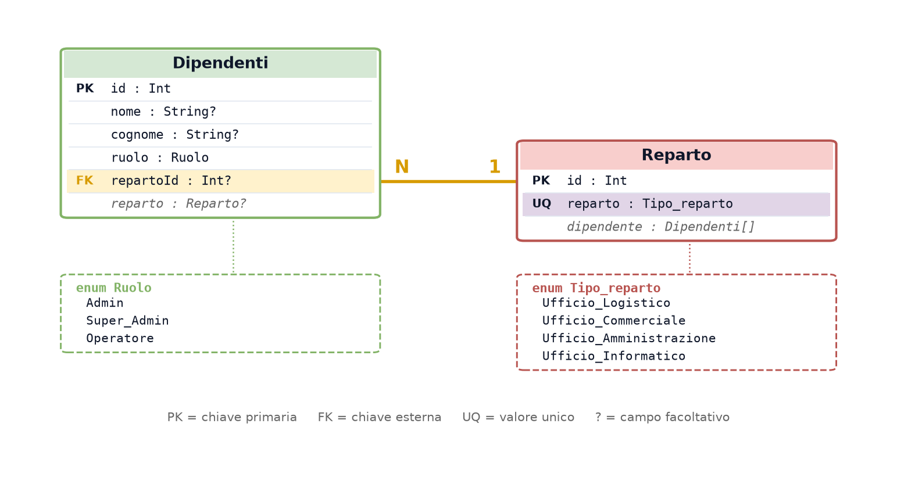

Lo schema completo è in
[`backend/prisma/schema.prisma`](backend/prisma/schema.prisma).  Concetti  fondamentali da conoscere sono: 

- **Entità:** Una entità è una cosa di cui teniamo traccia, e diventa una tabella:
qui `Dipendenti` e `Reparto`. Ogni riga è un caso concreto (un dipendente), ogni
colonna un attributo (nome, cognome, ruolo).
- **Chiave primaria (PK):** Il numero che identifica una riga in modo univoco:
`id`, assegnato dal database contando da 1. Due dipendenti possono chiamarsi
entrambi Mario Rossi, ma i loro `id` sono diversi — per questo si modifica e si
cancella per `id`, mai per nome.
- **Chiave esterna (FK):** La colonna che collega due tabelle: `repartoId` non
contiene il nome del reparto, contiene l'`id` della riga in `Reparto`. Il nome è
scritto una volta sola: correggerlo significa cambiare una riga, non cento.
- **Vincolo unico (UQ):** `@unique` su `reparto` vieta due reparti con lo stesso
nome, e permette di cercarlo per nome invece che per `id` — è ciò che rende
possibile `connectOrCreate`.
- **Enum:** Elenco chiuso di valori ammessi. Il ruolo `"Direttore"` viene respinto
dal database, non dal codice: vale anche scrivendo da Prisma Studio o da `psql`.
- **Campo facoltativo (`?`).** E'un campo che può restare vuoto (`NULL`) come`repartoId Int?`
significa che un dipendente può non avere ancora un reparto.
- **Una relazione è un legame fra due tabelle**  o dette in questo caso entità perciò è un modo per  legare un dipendente al reparto . Il legame ha un verso e una quantità. Qui è **uno-a-molti**: un dipendente sta in **un solo** reparto, un reparto contiene **molti** dipendenti. Nello schema si
annota **N — 1**.
- **La ricerca con indice con metodo  B-tree:** è un modo per accedere ad una riga (record) specifica `SELECT ... WHERE id = 42` , senza leggere tutte le righe e velocizzare la ricerca.

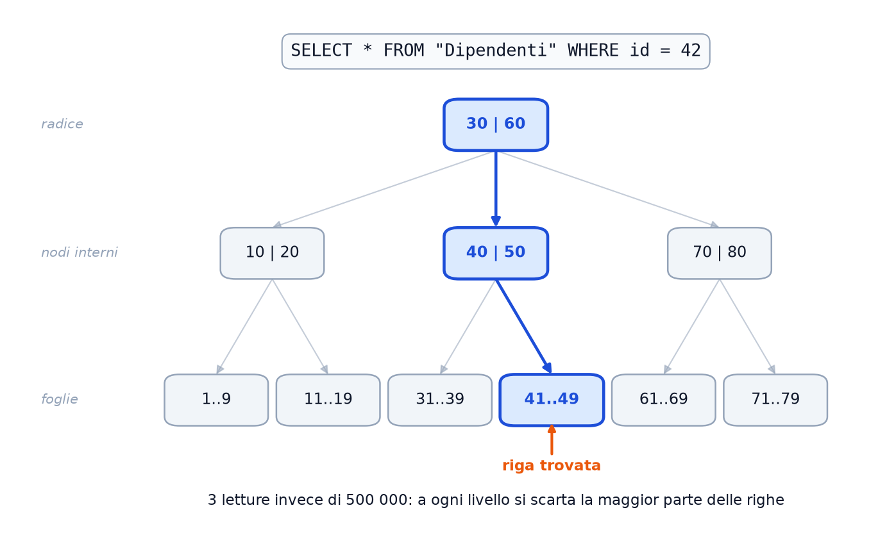

> L'immagine è generata da [`scripts/genera_btree.py`](scripts/genera_btree.py).
> Per rifarla: `python scripts/genera_btree.py`

### Prisma

Prisma **non è un database**: è un **ORM** (Object-Relational Mapping), cioè uno
strumento che fa da traduttore fra due mondi che ragionano in modo diverso. Il
codice JavaScript ragiona per **oggetti**; PostgreSQL (uno dei software open
source più usati al mondo) ragiona per **tabelle e righe**. Prisma sta in mezzo e
converte l'uno nell'altro.

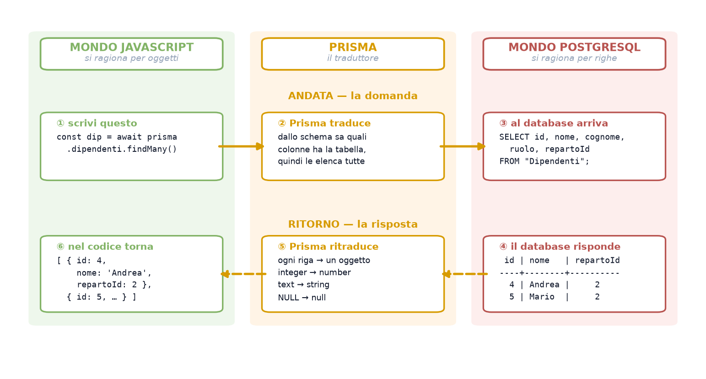

Perciò a ogni richiesta:

1) Creo una richiesta `prisma.dipendenti.findMany()`
2) Si legge il modello `Dipendenti` (in Prisma la tabella si chiama modello)
3) La query è `SELECT id, nome, cognome, ruolo, repartoId` e non `SELECT *`
4) Il database risponde con la porzione di tabella richiesta
5) Prisma la traduce in oggetti
6) Infine avremo il JSON

```json
{ "id": 4, "nome": "Andrea", "repartoId": 2,
  "reparto": { "id": 2, "reparto": "Ufficio_Informatico" } }
```


### Componenti base

Nel progetto servono solo `Int` e `String`, ma lo schema Prisma ne prevede molti
altri. I più comuni:

| Scrittura | A cosa serve |
|---|---|
| `String @db.VarChar(n)` | testo con lunghezza massima `n` |
| `String @db.Char(n)` | testo a lunghezza fissa, riempito di spazi |
| `Decimal @db.Decimal` | numeri con la virgola esatti — importi, pesi, misure |
| `Boolean` | vero o falso |
| `DateTime @default(now())` | data e ora di creazione, messa dal database |
| `DateTime @updatedAt` | data dell'ultima modifica, aggiornata da sola |
| `Bytes?` | dati binari |
| `@@map("nome_reale")` | usa nel database un nome di tabella diverso da quello del model |


### Visualizzare i dati

```bash
cd backend
npx prisma studio
```

Apre un'interfaccia grafica nel browser: si sfogliano le tabelle e si modificano
le righe a mano. Utile per controllare che una POST abbia scritto davvero quello
che doveva.

### Migrazioni DB

Non a ogni avvio, non una volta sola: **ogni volta che modifichi
`prisma/schema.prisma`**.

```bash
cd backend
npx prisma migrate dev --name <descrizione-della-modifica>
```

Il comando fa tre cose in fila: crea un file di migrazione (un `.sql` che
descrive il cambiamento), lo applica al database, e rigenera il client Prisma.
Senza, il codice continua a usare il vecchio modello e le query falliscono.

I file di migrazione restano in `prisma/migrations/` e si versionano con Git: sono
la storia di come lo schema è arrivato alla forma attuale, e permettono a chiunque
scarichi il progetto di ricostruire lo stesso database.


## Workflow ERP

Ci sono **due programmi distinti**, che girano su porte diverse e potrebbero stare su
macchine diverse.
- A sinistra il **browser**. `main.tsx` accende React, `App.tsx` è il contenitore,
`DipendentiPage.tsx` tiene i dati in memoria e disegna tabella e pulsanti. Quando servono
dati non li chiede al database — non può vederlo — ma chiama una funzione di
`api/dipendenti.api.ts`.
- A destra il **server**. `server.js` si mette in ascolto sulla porta 3000, `app.js`
configura Express, `routes` decide quale funzione chiamare per ogni indirizzo, il
`controller` esegue il lavoro e Prisma traduce tutto in SQL per PostgreSQL.
- In mezzo, in arancione, l'**unico punto di contatto**: una richiesta HTTP. È il motivo per
cui `DipendentiPage.tsx` non può importare il controller — sono due mondi separati, e
l'unico modo di parlarsi è mandarsi messaggi attraverso la rete.

Guardando le due colonne si nota che si somigliano: la pagina sta al controller come il
file `api/` sta a Prisma. I primi decidono cosa fare, i secondi parlano con l'esterno.

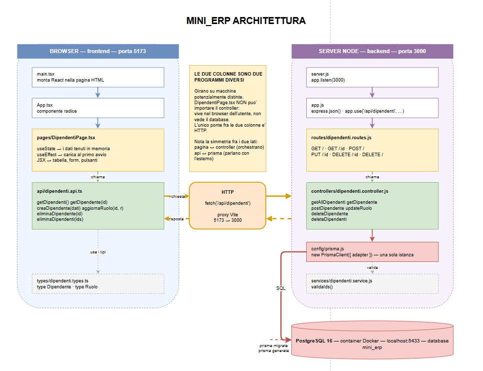

---

## Struttura

```
MINI_ERP/
│
├── docker-compose.yml
├── .gitignore
├── README.md
├── package.json
│
├── backend/
│   ├── .env
│   ├── prisma.config.js
│   │
│   ├── prisma/
│   │   ├── schema.prisma
│   │   └── migrations/
│   │
│   └── src/
│       ├── server.js
│       ├── app.js
│       ├── config/
│       │   └── prisma.js
│       ├── routes/
│       │   ├── index.js
│       │   └── dipendenti.routes.js
│       ├── controllers/
│       │   └── dipendenti.controller.js
│       ├── services/
│       │   └── dipendenti.service.js
│       ├── middlewares/
│       │   └── errorHandler.js
│       └── utils/
│           └── AppError.js
│
├── frontend/
│   ├── vite.config.ts
│   └── src/
│       ├── main.tsx
│       ├── App.tsx
│       ├── index.css
│       ├── api/
│       │   ├── client.ts
│       │   └── dipendenti.api.ts
│       ├── hooks/
│       │   └── useDipendenti.ts
│       ├── types/
│       │   └── dipendenti.types.ts
│       ├── pages/
│       │   └── DipendentiPage.tsx
│       └── components/
│           ├── Layout.tsx
│           ├── BarraDipendenti.tsx
│           ├── TabellaDipendenti.tsx
│           ├── FormDipendente.tsx
│           ├── ConfermaElimina.tsx
│           └── Dialogo.tsx
│
├── img/
├── scripts/
└── uml/
```

### Alla radice

| Elemento | Descrizione |
|---|---|
| `docker-compose.yml` | Definisce il container PostgreSQL 16, esposto sulla porta 5433 |
| `.gitignore` | Elenca i file che Git deve ignorare: `node_modules/`, `.env`, le cartelle di build |
| `README.md` | Questo documento |
| `package.json` | Metadati del progetto. Le dipendenze vere stanno in `backend/` e `frontend/` |
| `backend/` | Il server: Express, Prisma, la logica |
| `frontend/` | L'interfaccia: React e TypeScript |
| `img/` | Immagini usate in questo README |
| `scripts/` | Script Python che generano alcune immagini |
| `uml/` | Diagrammi in formato Draw.io |

Il `.gitignore` merita una riga in più: è ciò che tiene **`.env` fuori da GitHub**.
Quel file contiene la password del database, e una volta finito in un commit
resta nella storia del repository anche se lo cancelli dopo.

### Backend

| Elemento | Descrizione |
|---|---|
| `.env` | `DATABASE_URL` e `PORT`, non va su Git |
| `prisma.config.js` | Richiesto da Prisma 7: contiene l'URL |
| `prisma/schema.prisma` | Il nostro database  |
| `prisma/migrations/` | timeline delle modifiche allo schema, cioè le nostre migrazione |
| `src/server.js` | Serve per l'avvio: `app.listen(PORT)` |
| `src/app.js` | Configura Express: `express.json()` e il montaggio del router |
| `src/config/prisma.js` | Creea il `PrismaClient` una volta sola e lo condivide |
| `src/routes/index.js` | Raccoglie il router e lo monta sotto `/api` |
| `src/routes/dipendenti.routes.js` | Associa ogni indirizzo alla funzione del controller |
| `src/controllers/dipendenti.controller.js` | Legge `req`, chiama il service, scrive `res` |
| `src/services/dipendenti.service.js` | Validazioni e regole; non conosce HTTP |
| `src/middlewares/errorHandler.js` | Intercetta gli errori e li traduce in una risposta |
| `src/utils/AppError.js` | Gestisce errore con uno stato HTTP associato |

### Frontend

| Elemento | Descrizione |
|---|---|
| `vite.config.ts` | Ha il proxy che inoltra `/api` alla porta 3000 |
| `src/main.tsx` | Monta React nel DOM |
| `src/App.tsx` | il componente radice |
| `src/index.css` | gli stili |
| `src/api/client.ts` | la funzione di base per le chiamate e la gestione degli errori |
| `src/api/dipendenti.api.ts` | le sei chiamate verso il backend |
| `src/hooks/useDipendenti.ts` | tiene i dati e le azioni, così la pagina resta leggera |
| `src/types/dipendenti.types.ts` | i tipi TypeScript condivisi |
| `src/pages/DipendentiPage.tsx` | mette insieme barra, tabella e finestre |
| `src/components/Layout.tsx` | l'intelaiatura della pagina |
| `src/components/BarraDipendenti.tsx` | ricerca, filtri e pulsanti |
| `src/components/TabellaDipendenti.tsx` | disegna la tabella |
| `src/components/FormDipendente.tsx` | il modulo per creare e modificare |
| `src/components/ConfermaElimina.tsx` | la richiesta di conferma prima di cancellare |
| `src/components/Dialogo.tsx` | velo e riquadro, riusabile dalle altre finestre |

OSS:
Il DOM(Document Object Model) è la struttura a forma di albero che il browser crea leggendo una pagina HTML

## API e  Postman

**Postman** è la piattaforma leader usata da sviluppatori e tester per creare, inviare, testare, documentare e condividere richieste alle **API** in modo semplice e visivo. Si scrive a mano una
richiesta (**request**), la si invia, e si legge la risposta (**response**): così
si capisce se un errore viene dal server o dalla pagina React.

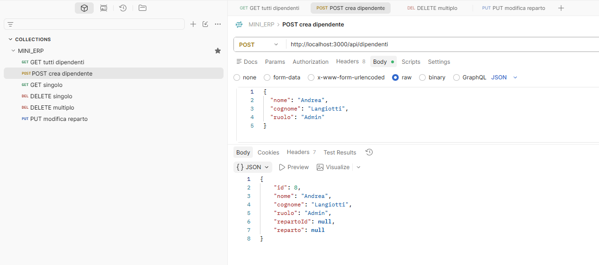

Nella figura una `POST` su `http://localhost:3000/api/dipendenti`, cioè la
creazione di un dipendente. Il **metodo** è di tipo  `POST`. Nel **Body** si sceglie `raw` con formato `JSON` e si scrivono solo i dati da salvare:

```json
{ "nome": "Andrea", "cognome": "Langiotti", "ruolo": "Admin" }
```

A seguito del Invio della richiesta, ci verrà restituito un JSON del tipo: 

```json
{ "id": 8, "nome": "Andrea", "cognome": "Langiotti", "ruolo": "Admin",
  "repartoId": null, "reparto": null }
```
Le sei possibili richieste sono: 

| Metodo | URL | Body | Cosa fa |
|---|---|---|---|
| `GET` | `/api/dipendenti` | — | elenca tutti |
| `POST` | `/api/dipendenti` | `{ "nome": "Mario", "cognome": "Rossi"}` | crea |
| `GET` | `/api/dipendenti/1` | — | legge il dipendente 1 |
| `PUT` | `/api/dipendenti/1` | `{ "ruolo": "Admin" }` | modifica il dipendente 1 |
| `DELETE` | `/api/dipendenti/1` | — | elimina il dipendente 1 |
| `DELETE` | `/api/dipendenti` | `{ "ids": [2, 3] }` | elimina i dipendenti 2 e 3 |

Gli URL vanno preceduti da `http://localhost:3000`.
I possibili avvisi e errori possono essere: 

| Codice | Quando |
|---|---|
| 200 | operazione riuscita |
| 201 | risorsa creata (POST) |
| 400 | input non valido — **colpa del client** |
| 404 | dipendente inesistente |
| 409 | vincolo di chiave esterna (Prisma `P2003`) |
| 500 | errore interno — **colpa del server** |

## UML

Gli schemi UML servono a capire **come lavorano le funzioni** prima di scriverle.
È buona norma disegnare prima lo schema e poi realizzare il codice: il disegno
costa cinque minuti, riscrivere il codice sbagliato ne costa molti di più.

I sorgenti sono in [`uml/`](uml/), in formato Draw.io: si aprono in VS Code con
l'estensione *Draw.io Integration*, oppure su
[app.diagrams.net](https://app.diagrams.net).

| File | Contenuto |
|---|---|
| `01-architettura` | mappa a due colonne, browser e server |
| `02-sequenza-get` | GET elenco, dal `useEffect` alla tabella |
| `03-sequenza-get-uno` | GET singolo, perché serve `Number(id)` |
| `04-sequenza-post` | POST, il ruolo di `express.json()` |
| `05-sequenza-put` | PUT, `where` contro `data` |
| `06-sequenza-delete` | DELETE singolo |
| `07-sequenza-delete-multiplo` | DELETE multiplo, con il service |
| `08-prisma-traduzione` | come Prisma traduce fra oggetti e tabelle |
| `09-schema-er` | schema ER: entità, attributi, relazione uno-a-molti |
| `10-flusso-backend` | il percorso di una richiesta, da HTTP a PostgreSQL |
| `11-flusso-frontend` | il percorso dei dati, dalla pagina alla rete |

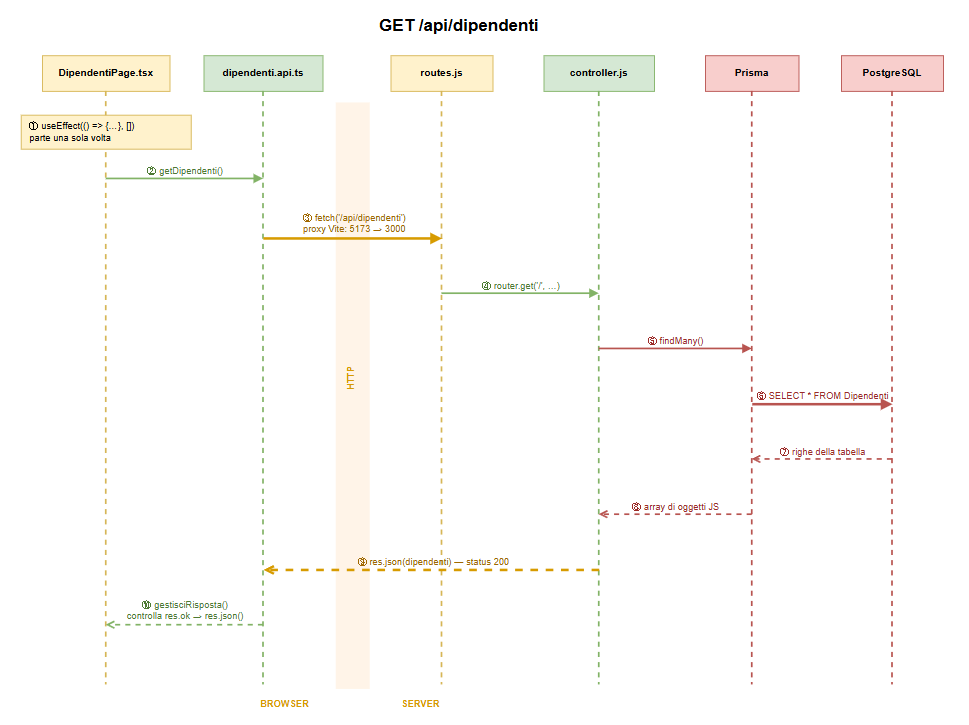

Nell'immagine viene mostrata una richiesta GET e come ogni elemento del gestionale gestisce la richiesta e restituisce una risposta:

1. **`useEffect(() => {...}, [])`** — Un utente apre la pagina per visualizzare dei dipendneti. L'array vuoto significa "esegui una volta sola": senza, partirebbe un ciclo infinito.
2. **`getDipendenti()`** — la pagina non parla con il database, chiama una
   funzione di `dipendenti.api.ts`.
3. **`fetch('/api/dipendenti')`** — qui si esce dal browser. Vite gira la
   richiesta dalla porta 5173 alla 3000: è il *proxy*, e serve a non dover
   configurare CORS.
4. **`router.get('/', ...)`** — Express riconosce l'indirizzo e chiama la
   funzione giusta del controller.
5. **`findMany()`** — il controller chiede i dati a Prisma.
6. **`SELECT * FROM Dipendenti`** — Prisma traduce in SQL e interroga PostgreSQL.
7. **righe della tabella** — il database restituisce righe.
8. **array di oggetti JS** — Prisma le ritraduce in oggetti JavaScript.
9. **`res.json(dipendenti)` con status 200** — il controller scrive la risposta,
   che riattraversa la rete.
10. **`gestisciRisposta()`** — controlla `res.ok`, poi `setDipendenti()` aggiorna
    lo stato. Cambiare lo stato fa ridisegnare la pagina: la tabella compare da
    sola.

L'ultimo punto è quello che conta: **non si tocca mai la tabella a mano**. Si
cambiano i dati, e React aggiorna lo schermo.

---

## Backend

Il backend è diviso in cartelle, ognuna con un compito solo. Una richiesta le
attraversa in quest'ordine:
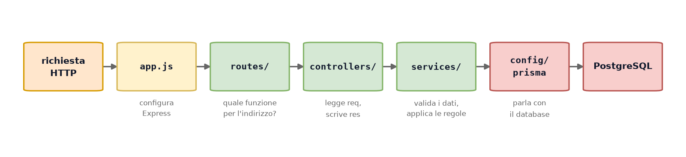
### Config

Serve per la connessione al database. Ogni richiesta usa **questa** istanza. Ci si connette una sola volta e non ogni volta che si esegue una richiesta, perciò si ha un solo `PrismaClient` per tutta l'applicazione [`config/prisma.js`](backend/src/config/prisma.js):

```js
const adapter = new PrismaPg({ connectionString: process.env.DATABASE_URL });

export const prisma = new PrismaClient({ adapter });
```

### Routes 

Le rotte non fanno il lavoro: dicono **quale funzione** chiamare a seconda del metodo (`GET`) e indirizzo. In [`routes/dipendenti.routes.js`](backend/src/routes/dipendenti.routes.js) abbiamo:

```js
router.get('/', getAllDipendenti);
router.get('/:id', getDipendente);
router.post('/', postDipendente);
router.put('/:id', updateDipendente);
router.delete('/:id', deleteDipendente);
router.delete('/', deleteDipendenti);
```
In realtà non useremo la rotta '/' ma  `/api/dipendenti` poichè è montato in `app.js`.

### Controllers 

Il controller è l'unico che conosce `req` e `res`. Il suo lavoro è sempre lo
stesso: prendere i dati dalla richiesta, chiedere al service se vanno bene,
chiamare Prisma, scegliere il codice di stato. Le sei funzioni ( CRUD) sono in
[`dipendenti.controller.js`](backend/src/controllers/dipendenti.controller.js):

| Funzione | Metodo | Cosa fa | Stato se va bene |
|---|---|---|---|
| `getAllDipendenti` | `GET /` | elenca, applicando i filtri | `200` |
| `getDipendente` | `GET /:id` | legge un dipendente | `200` |
| `postDipendente` | `POST /` | crea | `201` |
| `updateDipendente` | `PUT /:id` | modifica | `200` |
| `deleteDipendente` | `DELETE /:id` | elimina uno | `200` |
| `deleteDipendenti` | `DELETE /` | elimina molti | `200` |

Le sei funzioni sono:

- **`getAllDipendenti` — elencare.** Legge i filtri dall'indirizzo e costruisce
  l'elenco.

  ```js
  // GET /api/dipendenti
  export const getAllDipendenti = async (req, res) => {
      try {
          const { nome, cognome, ruolo, reparto } = req.query;

          const where = {};

          if (nome) where.nome = { contains: String(nome), mode: 'insensitive' };
          if (cognome) where.cognome = { contains: String(cognome), mode: 'insensitive' };
          if (ruolo) where.ruolo = String(ruolo);
          if (reparto) where.reparto = { reparto: String(reparto) };

          const dipendenti = await prisma.dipendenti.findMany({
              where,
              ...CON_REPARTO,
              orderBy: { id: 'asc' },
          });

          res.json(dipendenti);
      } catch (error) {
          gestisciErrore(error, res);
      }
  };
  ```

  L'oggetto `where` parte vuoto e si riempie solo con i filtri arrivati davvero.
  Se non ne arriva nessuno resta `{}` e Prisma restituisce tutto: una funzione
  sola copre sia "tutti" sia "filtrati". In SQL corrisponde a:

  ```sql
  SELECT * FROM "Dipendenti" WHERE nome ILIKE '%luc%' ORDER BY id ASC;
  ```

- **`getDipendente` — leggere uno.** Prima di ogni altra cosa valida l'id:

  ```js
  const esito = validaId(req.params.id);
  if (!esito.ok) return res.status(400).json({ error: esito.errore });
  ```

  Senza questo controllo, `/api/dipendenti/abc` diventerebbe `Number('abc')` →
  `NaN`, Prisma andrebbe in errore e il client riceverebbe un **500** — cioè
  "colpa del server" — quando invece la colpa è sua: **400**.

- **`postDipendente` — creare.** Valida il body, poi crea e risponde `201`, non
  `200`: significa *Created*, ed è la conferma che una risorsa nuova esiste.

- **`updateDipendente` — modificare.** Due validazioni, l'id e il body. Poi:

  ```js
  data: { nome, cognome, ruolo, reparto: costruisciReparto(reparto) }
  ```

  I campi `undefined` **Prisma li ignora**: mandando `{ "ruolo": "Admin" }` il
  nome resta quello di prima. Non serve rileggere il dipendente per riscriverlo
  intero.

- **`deleteDipendente` — eliminare uno.** Valida l'id e chiama `delete`. Se la
  riga non esiste Prisma **lancia** l'errore `P2025`, che diventa un **404**.

- **`deleteDipendenti` — eliminare in blocco.** Una sola query invece di un ciclo:

  ```js
  const result = await prisma.dipendenti.deleteMany({
    where: { id: { in: esito.ids } },
  });

  if (result.count === 0) {
    return res.status(404).json({ error: 'Nessun dipendente trovato' });
  }
  ```

  Attenzione alla differenza con il punto sopra: `deleteMany` **non lancia** se
  non trova nulla, restituisce `{ count: 0 }`. Va controllato a mano, altrimenti
  si risponde `200` a un'eliminazione che non ha eliminato niente.

### Services

Il service non sa cosa siano `req` e `res`. Riceve dati, restituisce dati:

```js
export const validaId = (valore) => {
  const id = Number(valore);

  if (!Number.isInteger(id) || id <= 0) {
    return { ok: false, errore: `Id non valido: "${valore}"` };
  }

  return { ok: true, id };
};
```

Sempre la stessa forma: `{ ok: true, dati }` oppure `{ ok: false, errore }`. È il
controller a tradurre l'esito in un codice HTTP — il service dice *cosa* non va,
come comunicarlo. Il vantaggio: queste funzioni si provano senza avviare il server, e le stesse
regole varrebbero identiche se domani il progetto cambiasse tipo di API.

Le funzioni in
[`dipendenti.service.js`](backend/src/services/dipendenti.service.js):

| Funzione | Controlla che |
|---|---|
| `validaId` | l'id sia un intero positivo |
| `validaIds` | l'array non sia vuoto e contenga almeno un id valido |
| `validaNuovoDipendente` | nome e cognome ci siano; ruolo e reparto siano ammessi |
| `validaModifica` | almeno un campo sia presente e i valori siano ammessi |
| `costruisciReparto` | traduce il nome del reparto nella forma che vuole Prisma |

**`costruisciReparto`** merita una riga in più, perché gestisce tre casi diversi:

```js
if (reparto === undefined) return undefined;          // non toccare il campo
if (reparto === null) return { disconnect: true };    // togli il reparto

return { connectOrCreate: { where: { reparto }, create: { reparto } } };
```

`connectOrCreate` collega il dipendente al reparto e, se quel reparto non esiste
ancora, lo crea. È possibile perché `reparto` ha `@unique`: senza, non si potrebbe
cercarlo per nome.

### Middlewares e utils

Un **middleware** è una funzione che sta *in mezzo*: vede la richiesta prima del
controller e può fermarla, modificarla o lasciarla passare. Nel progetto ne è
attivo uno, quello di Express:

```js
app.use(express.json());
```

Legge il corpo della richiesta e lo trasforma in `req.body`. Senza, `req.body`
resta `undefined` e ogni POST fallisce — è l'errore che in Postman si manifesta
scegliendo *Text* invece di *raw → JSON*. Le cartelle [`middlewares/`](backend/src/middlewares/) e
[`utils/`](backend/src/utils/) esistono ma i file dentro sono **vuoti**: sono
predisposte per due passi successivi.

### Osservazioni

- **Gestione degli errori.** Una funzione sola, richiamata da tutte e sei nel
  `catch`:

  ```js
  const gestisciErrore = (error, res) => {
    if (error.code === 'P2025') return res.status(404).json({ ... });
    if (error.code === 'P2003') return res.status(409).json({ ... });
    console.error(error);
    return res.status(500).json({ error: 'Errore interno del server' });
  };
  ```

  `P2025` (riga non trovata) e `P2003` (chiave esterna) sono codici di Prisma. Il
  dettaglio del 500 va nel log, non nella risposta: al client non si dice com'è
  fatto il database dentro.

- **Validazione dei dati.** Non fidarsi mai di quello che arriva da fuori: può
  essere il nostro frontend, ma anche Postman o uno script. Va fatta **prima** di
  Prisma, altrimenti un dato sbagliato diventa `500` invece di `400`.

- **Zod** — libreria che genera i controlli da uno schema, al posto degli `if`
  scritti a mano. Non installata.

- **ESLint** — segnala gli errori nel codice: variabili inutilizzate, `await`
  dimenticati. ESLint dice se il codice è **sbagliato**

- **Prettier** — uniforma la formattazione a ogni salvataggio. Prettier come **appare** e ci indica
  come migliorarlo

- **Programmazione Asincrona**- Ogni controller è dichiarato `async` e ogni chiamata a Prisma ha un `await`:

  ```js
  const dipendenti = await prisma.dipendenti.findMany();
  ```

  Il motivo è che interrogare il database **richiede tempo**: Node deve aspettare
  la risposta di PostgreSQL. Node però ha un thread solo — se restasse fermo ad
  aspettare, tutte le altre richieste in arrivo rimarrebbero in coda.

  `await` risolve questo: mette in pausa **quella funzione**, lascia Node libero di
  occuparsi di altro, e la riprende quando i dati sono pronti.

  Due conseguenze pratiche:

  - **senza `await`** si ottiene una *Promise* invece dei dati — l'oggetto che
    rappresenta "la risposta arriverà". Mandarla al client produce `{}`.
  - **`await` va dentro `try/catch`**: se la query fallisce, l'errore viene lanciato
    lì. È il motivo per cui tutti i controller hanno quella struttura.


## Frontend

Anche il frontend è diviso per compito, e la regola è una sola: **i componenti non
sanno che esiste una rete**. Ricevono dati come *props* e comunicano con
*callback*.

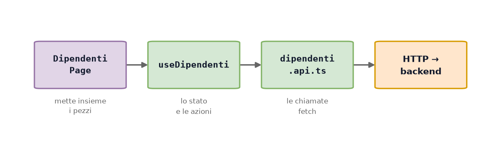

### Types 

TypeScript serve a sapere **prima di eseguire** che forma hanno i dati. In
[`dipendenti.types.ts`](frontend/src/types/dipendenti.types.ts) ci sono tre tipi
per lo stesso dipendente, ed è voluto:

```ts
// Come arriva dal backend: i campi ci sono sempre, il valore può essere null
export type Dipendente = {
  id: number;
  nome: string | null;
  ruolo: Ruolo;
  reparto: Reparto | null;
};

// Cosa mandi per crearne uno: l'id lo assegna il database
export type NuovoDipendente = {
  nome: string;
  cognome: string;
  ruolo?: Ruolo;
};

// Per la modifica: ogni campo è facoltativo
export type ModificaDipendente = {
  nome?: string;
  ruolo?: Ruolo;
};
```
Sono diversi perché **le tre situazioni sono diverse**: in lettura l'`id` c'è di
sicuro, in creazione non esiste ancora, in modifica quasi tutto è facoltativo. Un
tipo unico costringerebbe a scrivere `id?` e perderebbe proprio il controllo che
serve.


### Api

[`dipendenti.api.ts`](frontend/src/api/dipendenti.api.ts) contiene sei funzioni,
una per endpoint, e una funzione condivisa che merita attenzione:

```ts
async function gestisciRisposta(res: Response) {
  if (!res.ok) {
    const corpo = await res.json().catch(() => ({}));
    throw new Error(corpo.error || `Errore ${res.status}`);
  }
  return res.json();
}
```

Esiste perché **`fetch` non considera un errore i codici HTTP**. Un 404 o un 500
arrivano come risposte normali, con `res.ok` a `false`. Senza questo controllo il
messaggio d'errore del server finirebbe nella tabella come se fosse un dipendente.

Una chiamata tipica:

```ts
export async function creaDipendente(dati: NuovoDipendente): Promise<Dipendente> {
  const res = await fetch(BASE, {
    method: 'POST',
    headers: { 'Content-Type': 'application/json' },
    body: JSON.stringify(dati),
  });
  return gestisciRisposta(res);
}
```

L'header `Content-Type` è obbligatorio: è ciò che fa funzionare `express.json()`
dall'altra parte.

### Hooks

Un **hook** è una funzione che raccoglie logica riutilizzabile. Per convenzione il
nome inizia con `use`. Perciò [`useDipendenti.ts`](frontend/src/hooks/useDipendenti.ts) tiene tutto lo stato
della pagina — l'elenco, l'errore, le selezioni, quali finestre sono aperte — e
restituisce insieme i dati e le funzioni per modificarli:

```ts
export default function useDipendenti() {
  const [dipendenti, setDipendenti] = useState<Dipendente[]>([]);
  const [errore, setErrore] = useState<string | null>(null);
  const [selezionati, setSelezionati] = useState<number[]>([]);

  const ricarica = async () => {
    try {
      setDipendenti(await getDipendenti());
      setErrore(null);
    } catch (e) {
      mostraErrore(e);
    }
  };

  useEffect(() => { void ricarica(); }, []);   // una volta sola, all'apertura

  return { dipendenti, errore, selezionati, salva, ricarica, /* ... */ };
}
```

Senza l'hook, tutto questo starebbe dentro `DipendentiPage`, che diventerebbe
lunga e difficile da leggere. Con l'hook la pagina si limita a **disporre** i
pezzi. Dopo ogni salvataggio o eliminazione si chiama `ricarica()`: si rilegge l'elenco
dal server invece di aggiornare l'array in memoria. Costa una richiesta in più,
ma garantisce che quel che si vede sia quel che c'è davvero nel database.

Esistono vari tipi di Hooks:

- **`useState`** — tiene un valore che, cambiando, fa ridisegnare la pagina. Qui
  l'elenco dei dipendenti, l'errore, le caselle selezionate.

  ```ts
  const [dipendenti, setDipendenti] = useState<Dipendente[]>([]);

  setDipendenti(await getDipendenti());   // cambia il valore → la tabella si ridisegna
  ```

- **`useEffect`** — esegue qualcosa *dopo* il disegno. Qui la prima lettura
  dall'API: con `[]` parte una volta sola, all'apertura.

  ```ts
  useEffect(() => { void ricarica(); }, []);   // [] = solo all'apertura
  ```

  Mettendo una variabile fra le parentesi quadre — `[filtro]` — l'effetto
  riparte ogni volta che quella cambia.

- **`useRef`** — conserva un valore fra un disegno e l'altro **senza** farne
  scattare uno nuovo. Tipico per puntare a un elemento della pagina:

  ```ts
  const campoNome = useRef<HTMLInputElement>(null);

  useEffect(() => { campoNome.current?.focus(); }, []);   // cursore nel campo

  return <input ref={campoNome} />;
  ```

- **`useMemo`** — ricalcola solo quando serve. Utile per un'operazione pesante,
  che altrimenti si ripeterebbe a ogni disegno:

  ```ts
  const ordinati = useMemo(
    () => [...dipendenti].sort((a, b) => a.cognome.localeCompare(b.cognome)),
    [dipendenti]        // riordina solo se l'elenco cambia
  );
  ```

- **`useContext`** — legge un dato condiviso senza passarlo di props in props:

  ```ts
  const TemaContext = createContext('chiaro');

  function Pulsante() {
    const tema = useContext(TemaContext);   // lo legge direttamente
    return <button className={tema}>Salva</button>;
  }
  ```

I primi due sono quelli usati in `useDipendenti`. Gli altri non servono a un
progetto di queste dimensioni, ma sono i successivi da conoscere.

Oltre a questi ci sono gli **hook personalizzati**, come `useDipendenti`: non
sono forniti da React, li scrivi tu combinando i precedenti. La regola è che il
nome inizi per `use`.

```ts
function useDipendenti() {
  const [dipendenti, setDipendenti] = useState([]);   // hook di React
  useEffect(() => { /* ... */ }, []);                 // hook di React

  return { dipendenti, ricarica };                    // quello che serve alla pagina
}
```


### Pages

[`DipendentiPage.tsx`](frontend/src/pages/DipendentiPage.tsx) non contiene
logica: prende tutto dall'hook e lo distribuisce ai componenti.

```tsx
export default function DipendentiPage() {
  const { dipendenti, errore, selezionati, /* ... */ } = useDipendenti();

  return (
    <div className="pagina">

      <BarraDipendenti 
      numeroSelezionati={selezionati.length}
      nCrea={apriCreazione} 
      />

      <TabellaDipendenti
        dipendenti={dipendenti}
        onModifica={apriModifica}
        onElimina={apriEliminazioneSingola}
      />

      {formAperto && 
      <FormDipendente
       dipendente={inModifica}
       onSalva={salva} 
       />}

    {errore && <p className="errore">{errore}</p>}   

    </div>
  );
}
```


### Components 
I componets sono utili per interfaccia grafica della pagina: 


| Componente | Cosa disegna |
|---|---|
| `Layout` | l'intelaiatura della pagina |
| `BarraDipendenti` | titolo, pulsante *Crea*, azioni sulla selezione |
| `TabellaDipendenti` | l'elenco, con le caselle di selezione |
| `FormDipendente` | il modulo per creare e modificare |
| `ConfermaElimina` | la domanda prima di cancellare |
| `Dialogo` | velo grigio e riquadro bianco, riusabile |

Nessuno di questi importa `dipendenti.api.ts`. Ricevono dati e restituiscono
intenzioni: `onModifica`, `onElimina`, `onSalva`. È lo stesso principio del
service nel backend — **chi disegna non decide**, e chi decide non disegna.
Il vantaggio pratico: `TabellaDipendenti` funziona identica se un domani i dati
arrivassero da un file invece che dalla rete.

## Visualizzazione
**Visualizza.** La prima schermata che ci compare 
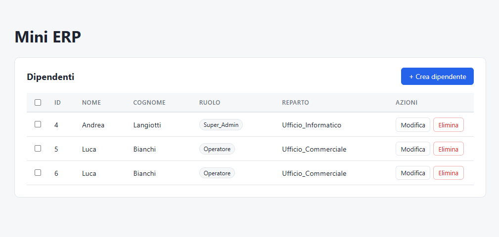

**Creare.** Il pulsante *Crea dipendente* apre `FormDipendente` con i campi
vuoti. Il ruolo parte da `Operatore`, il reparto da *— nessuno —*: sono i valori
predefiniti dello schema.

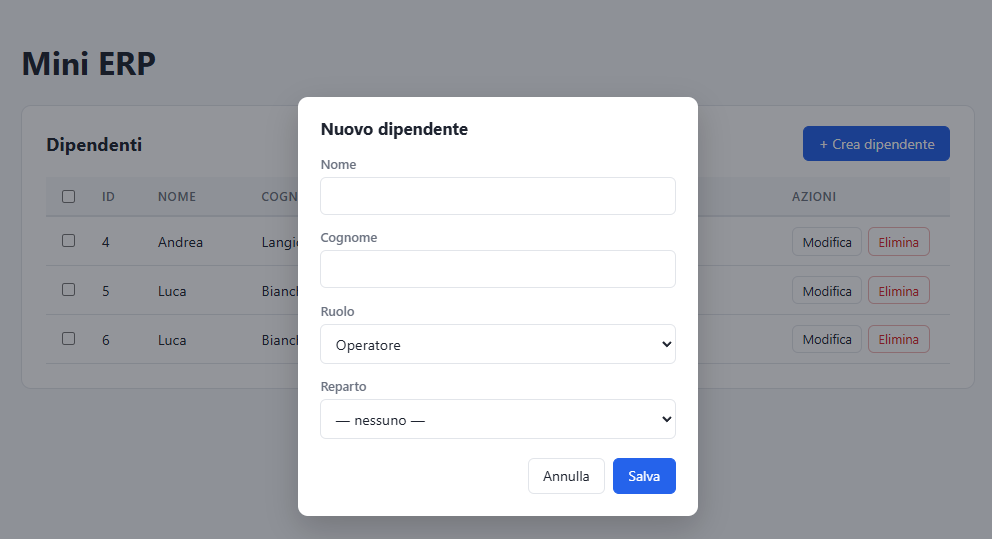

**Modificare.** Stesso componente, stessa finestra — cambia solo che i campi
arrivano già pieni. È il senso di questa riga in `DipendentiPage`:

```tsx
{formAperto && <FormDipendente dipendente={inModifica} onSalva={salva} />}
```

Se `inModifica` è `null` il form è vuoto e si crea; se contiene un dipendente il
form è precompilato e si modifica. Un componente solo per due operazioni.

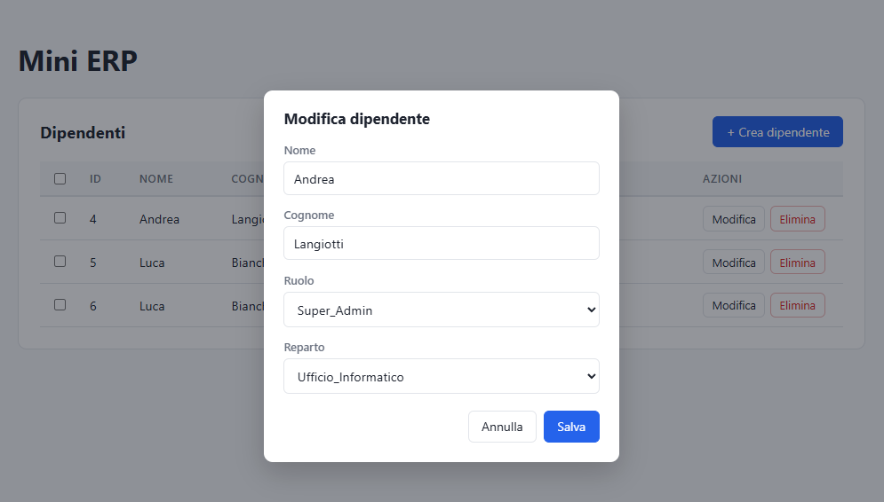

**Eliminare uno.** Il pulsante *Elimina* non cancella subito: apre
`ConfermaElimina`, che mostra il nome e avverte che l'operazione non è
reversibile. La cancellazione parte solo dopo la conferma.

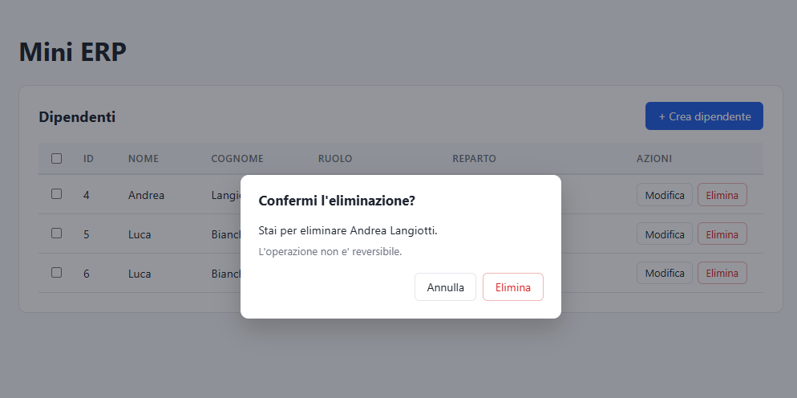

**Eliminare molti.** Le caselle a sinistra riempiono l'array `selezionati`
dell'hook. Appena ne contiene almeno uno compare il pulsante *Elimina selezionati*,
con il numero fra parentesi:

```tsx
<BarraDipendenti numeroSelezionati={selezionati.length} ... />
```

Alla conferma parte **una sola** richiesta `DELETE` con tutti gli id nel body —
non una per dipendente.

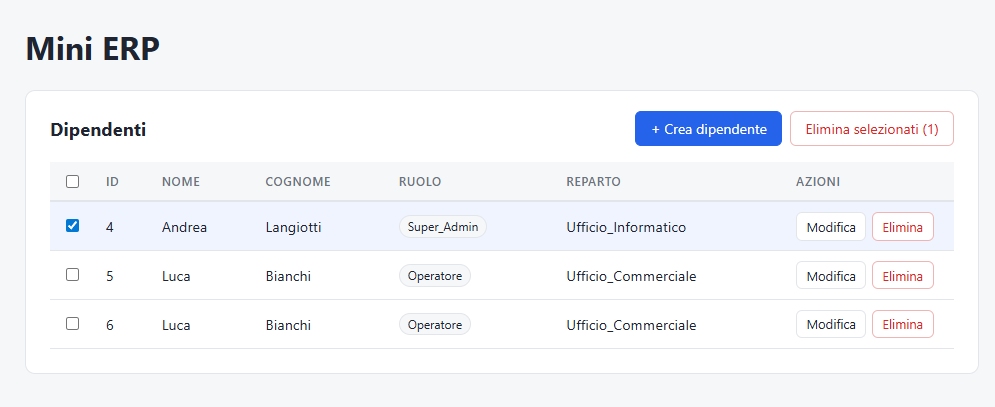


